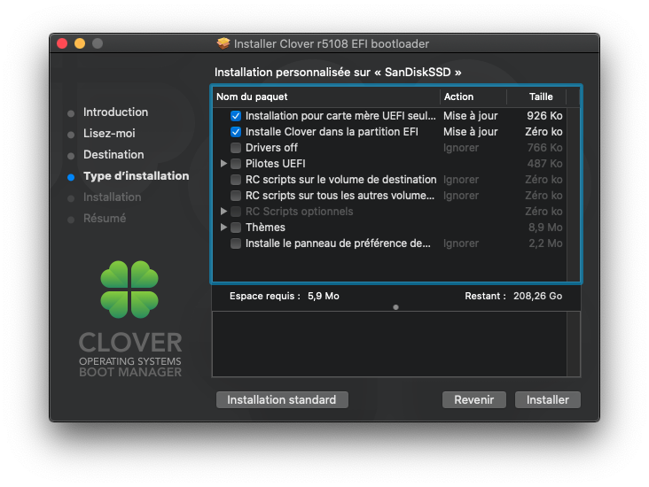

# Hackintosh (macOS) sur Lenovo ThinkPad L380 Yoga avec Clover

Ce dépôt contient un exemple de configuration pour exécuter grâce au chargeur de démarrage Clover le système d'exploitation macOS (Catalina 10.15.4) sur un **Lenovo ThinkPad L380 Yoga**.

Cet exemple de configuration pourrait **possiblement** et **partiellement** voir totalement compatible avec les ordinateurs suivants :

- L380 (non-Yoga)
- L390 (non-Yoga)
- L390 Yoga.
- X380
- X390

## Configuration utilise

#### Lenovo ThinkPad L380 Yoga

La configuration de base de cet ordinateur n'a pas été changé **hormis** la carte PCI-E m2 WIFI de série par une carte WIFI **Broadcom BCM94352Z**.

Type | Spécification |Statut
-----|-----|------
Micro-logiciel|Version `1.20`| N/A
Processeur|Intel i3-8250U|Fonctionnel
Processeur graphique|Intel UHD Graphics 620|Fonctionnel
Mémoire vive|8Go DDR4 a 2400MHz|Fonctionnel
Carte WIFI & Bluetooth |Broadcom BCM94352Z|Fonctionnel
Stockage|SSD NVME 256Go|Fonctionnel
Écran| 1080p FHD|Fonctionnel
Stylet et capteurs multipoints|Wacom Co|Fonctionnel
Chispet audio|Realtek ALC257|Fonctionnel
Camera integre|Chicony Electronics 720p|Fonctionnel
Microphone integre|Spécification inconnue|Fonctionnel
TouchPad|Spécification inconnue|*Partiellement fonctionnel*
TrackPoint|Spécification inconnue|*Fonctionnel avec [SmartScroll]*
Clavier|Spécification inconnue, QWERTY, sans retro-eclerage|*Partiellement fonctionnel*
USB2.0 & 3.0 & USB-C|Intel Corporation USB 3.0 xHCI Controller (rev 21)|Fonctionnel
Lecteur de cartes SD|Spécification inconnue|*Non fonctionnel*
Lecteur d'empreinte digitale|Spécification inconnue|*Non fonctionnel*

[SmartScroll]: https://www.marcmoini.com/sx_fr.html

## Installation

- Désactivez le Secure Boot dans le BIOS.

- Désactivez le WLAN WIFI dans le BIOS.

- Installez macOS sur une clef USB (https://support.apple.com/fr-fr/HT201372).

- Installez Clover sur une clef USB (de préférence sur une seconde), sélectionnez installation UEFI seulement comme ceci:

- Montez la partition EFI qui aura été créée par l'installateur de Clover.

- Supprimez le dossier EFI qui aura été créée par l'installateur puis remplacer le par le dossier EFI de ce dépôt.

- Démarrez votre ordinateur avec la clef USB macOS et la clef USB Clover branché à votre ordinateur.

- Installez macOS.

- Installez Clover sur votre nouveau macOS, montez la partition EFI qui aura été créée par l'installateur de Clover, supprimez le dossier EFI qui aura été créée par l'installateur puis remplacer le par le dossier EFI de ce dépôt.

- Réactivez le WLAN WIFI dans le BIOS.

- Fin.

Vous pouvez par la suite activer FileVault après l'installation de macOS ou bien plus tard, ce dernier marche parfaitement.

## Problèmes

- Certaines touches du clavier ne sont pas mappées correctements comme la touche [Delete].

- Pas de détection de la fermeture du capot de l'écran (pas de mise en veille automatique dans ce cas de figure).

- Pas de détection du changement d'orientation de l'ordinateur via l'accéléromètre.

- Pas de lecture d'empreintes digitales.

- Pas de lecteur de cartes SD.

## Crédits

https://github.com/spurd0/l380-yoga-hackintosh Base de ce dépôt.

https://github.com/linusyang92/macOS-ThinkPad-T480s Autre ressource.
